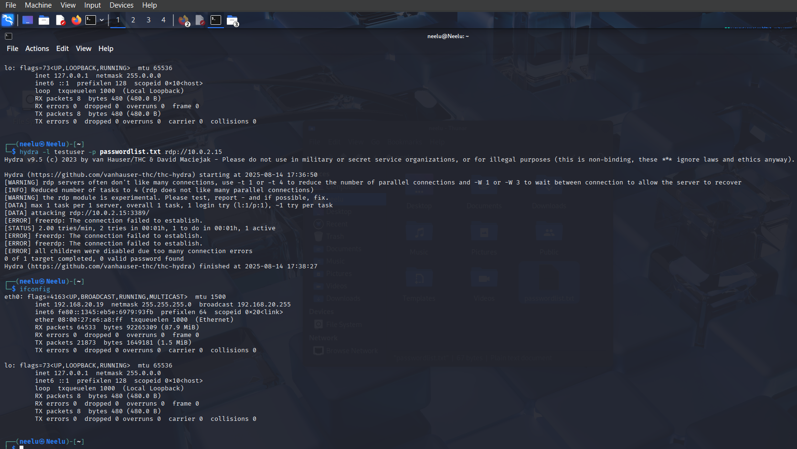
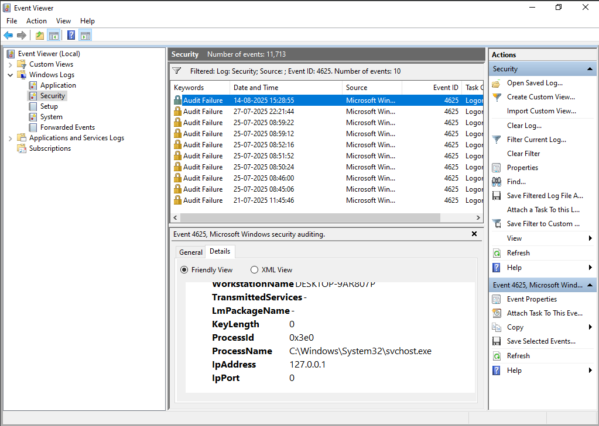
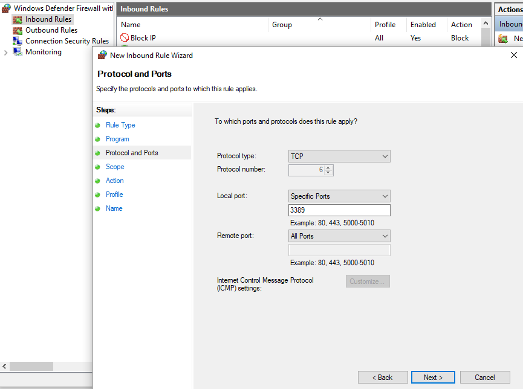
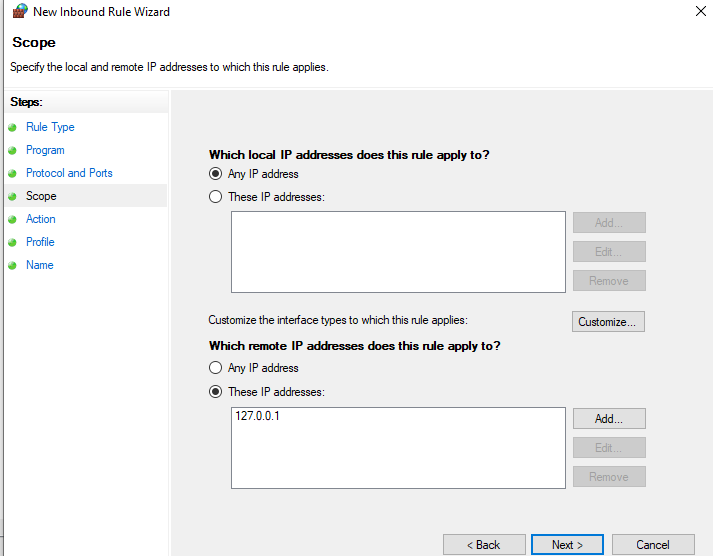
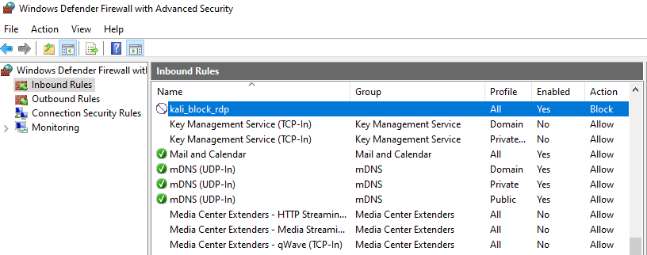
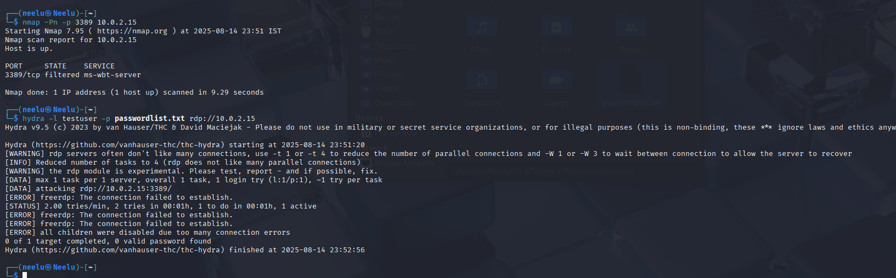
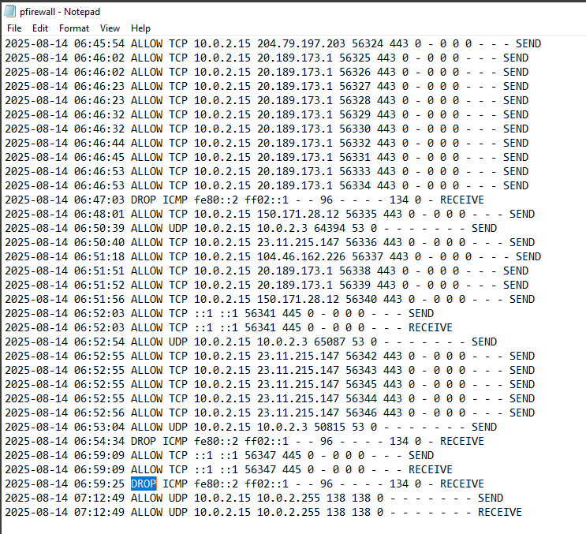

##  Lab Task: Detect and Respond: Windows RDP Brute Force Attack

---

## Lab Setup and Requirements

### Machines Required:
- **Windows VM**
  - RDP enabled
  - Event Viewer access
  - One local user account with known username
- **Kali Linux VM**
  - Hydra pre-installed 
  - Connected to same LAN or Virtual Network

*Hydra tool*  
(Hydra is a brute-forcing tool that helps penetration testers and ethical hackers crack the passwords of network services. Hydra can perform rapid dictionary attacks against more than 50 protocols. This includes telnet, FTP, HTTP, HTTPS, SMB, databases, and several other services.
)

### Network:
- Ensure both machines are on the same network
- Verify RDP (TCP/3389) is open on Windows Server

## Preparation Steps

### On **Windows**:
1. Enable RDP 
   System Properties → Remote → Enable Remote Desktop

2. Allow RDP in Firewall:  
   Windows Defender Firewall → Advanced Settings → Inbound Rules → Remote Desktop (TCP-In) → Enable

3. Create Test User
   net user testuser Password123 /add

   Open Event Viewer
   Windows Logs → Security
   Filter for Event ID 4625 (Failed Logon)

### On **Kali Linux**:
1. install hydra: 
    sudo apt update && sudo apt install hydra
2. Run this command on Kali Linux:

    hydra -l testuser -p passwordlist.txt rdp:// 10.0.2.15
    

### Visualize the Alert in Event Viewer on windows vm

Open Event Viewer → Windows Logs → Security

Look for Event ID 4625 with:

Failure Reason: "Unknown user name or bad password"

### Incident Response Steps
1. Identify Repeated Failed Logons:
    Spot Event ID 4625 from same IP
    

2. Correlate IP Address:
    Confirm repeated failures from attacker’s IP
3. Lock the User Account:
   net user testuser /active:no
    
4. Block Attacker IP:

    New-NetFirewallRule -DisplayName "Block Attacker" -Direction Inbound -RemoteAddress <Kali_IP> 

    -Action Block
   
   
   
   

    after blocking ip we noticed that tcp/3389 filtered

    
    

6. Collect Evidence:
     relevant Event Logs
     

7. Report Incident:
     a brief report with findings and actions taken

